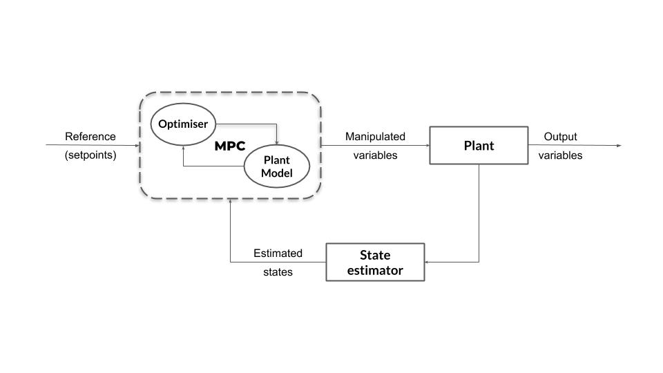
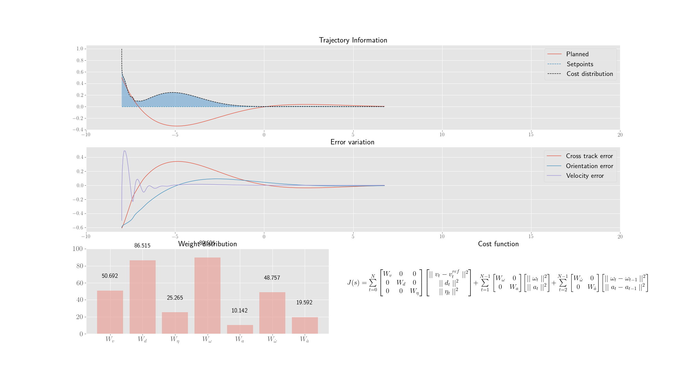
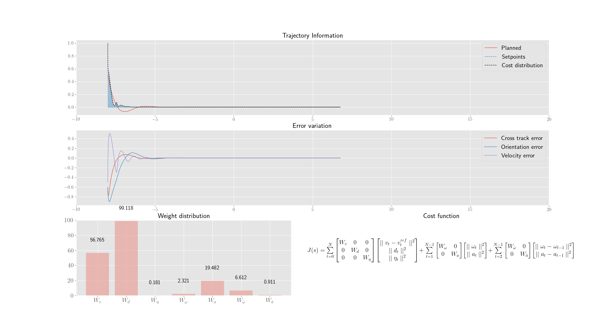
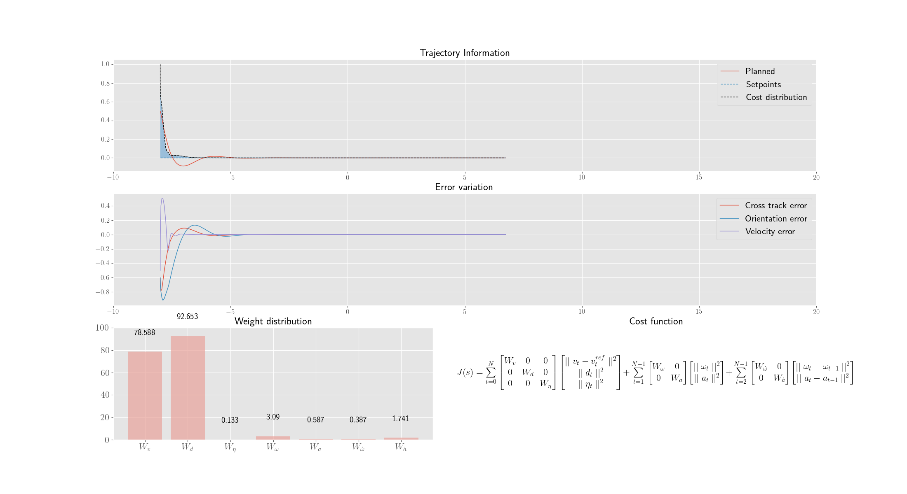
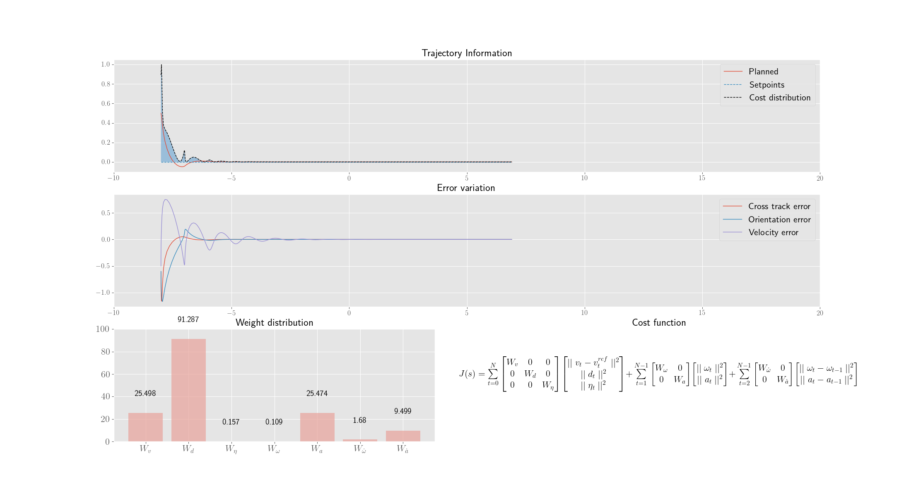
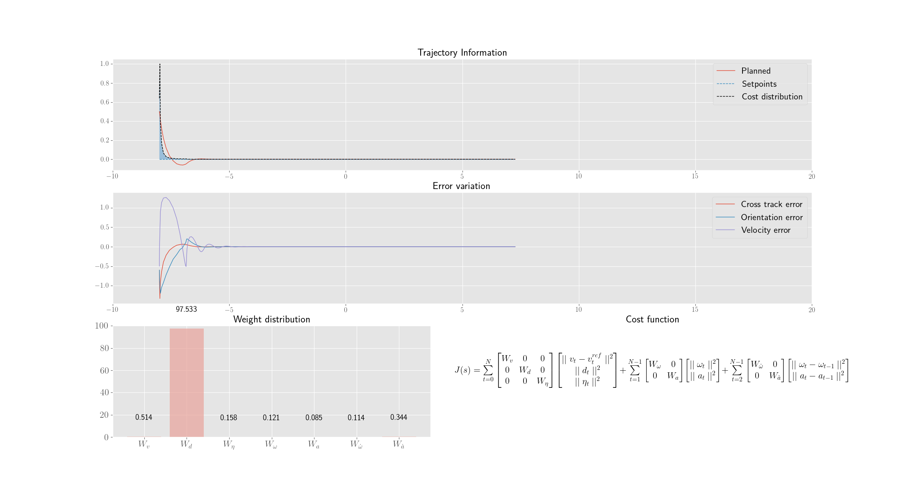

# GA aided MPC tuning

Using Genetic Algorithms to tune the gains of a Nonlinear Model Predictive Controller

## Description

This is an approach to tune the gains of a **Nonlinear Model Predictive Controller** using **Genetic Algorithms**. The controller is used for trajectory tracking in a **differential drive** robot.

## Jump to

- [Dependencies](#dependencies)
- [Targets](#targets) (Available binaries)
- [Usage](#usage)
  - [Compile and run in docker container](#compile-and-run-in-docker-container) (Recommended)
  - [Compile and run in local machine](#compile-and-run-in-local-machine)
- Other information
  - [NMPC design for Differential drive](#nonlinear-model-predictive-control-for-differential-drive)
  - [Genetic Algorithm](#genetic-algorithm)

## Dependencies

- Python >= 3.6

- CMake >= 3.18

## Targets

| Executable       | Description                                                                                                                                    |
| ---------------- | ---------------------------------------------------------------------------------------------------------------------------------------------- |
| **mpc_mono**     | Run a single instance of a controller. Stops when the Cross track error, Orientation error and Velocity error are within a specified tolerance |
| **hone_weights** | Run the genetic algorithm and tune the gains                                                                                                   |

**NOTE**: All the parameters for the above need to be specified in the appropriate configuration files in the **`config`** directory

## Usage

- [In local machine](#compile-and-run-in-local-machine)
- [In docker container](#compile-and-run-in-docker-container) (**preferred**)
  <br/>

**NOTE:** Specify the configurations in the `config` directory before executing binaries

### Compile and run in docker container

- Build docker image

```bash
docker build --tag <image-name> .
```

- Build and run binaries in container

```bash
docker run --rm -it -v $(pwd):/workspace <image-name> <binary-name>
```

Example:

```bash
docker build --tag ga_mpc .
docker run --rm -it -v $(pwd):/workspace ga_mpc mpc_mono
```

**NOTE**: For available binaries, refer [targets](#targets)

### Compile and run in local machine

```bash
git clone --recurse-submodules https://github.com/ashwin5059198/GA-aided-MPC-tuning
cd GA-aided-MPC-tuning
```

- Install **CppAD** and **IPOPT** solver for NMPC

```bash
sudo apt install cppad
wget --no-check-certificate https://www.coin-or.org/download/source/Ipopt/Ipopt-3.12.7.zip
unzip Ipopt-3.12.7.zip -d /opt && rm Ipopt-3.12.7.zip
bash ./scripts/bash/install_ipopt.sh /opt/Ipopt-3.12.7/
export LD_LIBRARY_PATH ${LD_LIBRARY_PATH}:/usr/local/lib
```

- Install python libraries for visualisation

```bash
python -m pip install -r requirements.txt
```

- Build

```bash
mkdir build
cd build
cmake ..
make
cd ..
```

- Run binaries (assuming appropriate configurations are set)

```bash
./bin/mpc_mono # or ./bin/hone_weights
```

- Visualise data

```bash
python scripts/python/plot.py
```

## Nonlinear Model Predictive Control for differential drive

#### Workflow



**Setup** :

&nbsp;&nbsp;&nbsp;&nbsp;1. Define length of prediction horizon, _N_, and duration of each timestep, _dt_.

&nbsp;&nbsp;&nbsp;&nbsp;2. Define vehicle dynamics and actuator limitations along with other constraints.

&nbsp;&nbsp;&nbsp;&nbsp;3. Define cost function

**Loop** :

&nbsp;&nbsp;&nbsp;&nbsp;1. Pass current state as initial state to model predictive controller.

&nbsp;&nbsp;&nbsp;&nbsp;2. Call the optimization solver (_Ipopt_ in our case). It will return a vector of control inputs that minimizes the cost function.

&nbsp;&nbsp;&nbsp;&nbsp;3. Apply first control input to vehicle.

&nbsp;&nbsp;&nbsp;&nbsp;4. Back to 1

#### Plant Model


> <br>
>
> **Dynamics**
>
> 
>
> **Constraints**
>
> 
>
> **Cost function**
>
> 

## Genetic Algorithm

### Parameters used

|      Parameter       |    Type / value     |
| :------------------: | :-----------------: |
|       Encoding       |       Binary        |
|   Population size    |         20          |
| Maximum generations  |         100         |
|     Mating pool      |          5          |
|      Selection       |  Fitness function   |
|      Crossover       | Uniform (bias: 0.5) |
|       Mutation       |      Bit flip       |
| Mutation probability |        0.01         |

### Description

- Each genome represents a set of MPC weights.

- Each genome(weight set) is then used in a MPC control loop for **300** iterations and the variation of Cross track error, orientation errors and other parameters are noted.

- The **fitness function** is just the inverse of **_weighted average of the Integral Time Absolute Error (ITAE) of the errors and energy loss of the robot (both translational and rotational)_**

```cpp
double ITAE1 = 0.0, ITAE2 = 0.0, ITAE3 = 0.0;
double EL1 = 0.0, EL2 = 0.0;

const double w1 = 4.0;
const double w2 = 3.0;
const double w3 = 2.0;
const double w4 = 2.0;
const double w5 = 2.0;

for (size_t i = 0; i < iterations; i++)
{

    ITAE1 += (i + 1) * abs(performance.cteData[i]);
    ITAE2 += (i + 1) * abs(performance.ethetaData[i]);
    ITAE3 += (i + 1) * abs(performance.velocityErrorData[i]);

    EL1 += abs(performance.translationalEnergyLoss[i]);
    EL2 += abs(performance.rotationalEnergyLoss[i]);
}

fitness += 10000 * (w1 + w2 + w3 + w4 + w5) / (w1 * ITAE1 + w2 * ITAE2 + w3 * ITAE3 + w4 * EL1 + w5 * EL2);

```

- Data of the best genome in each generation is stored in JSON format and is later used to visualise the learning process

#### Interactive Decision Tree Algorithm

- The weights used in the fitness function to calculate the weighted average is determined using a **Interactive Decision Tree** approach.The decision tree provides a decision support tool for the selection of weights that can improve the objective function. It prompts for the operator response to determine the improvements in the performance metrics. The response-based interaction reduces the manual overhead and also has the potential to capture expert knowledge. Thus, the integration of expert knowledge with GA can guarantee convergence and provide optimal MPC tuning.

- Initially, the weights for individual metrics (w i ) in the objective function are distributed uniformly.

- The MPC weights are tuned using this objective function. The objective of the GA is to determine the MPC weights that minimize the fitness function with uniform weighted metrics.

- After each generation, The performance improvement in these metrics for GA determined MPC weights are evaluated. The algorithm interacts with the operator to determine the weakly improved metrics.

- If all the metrics are improved to the satisfactory level of the operator, then the operator selects none of the metrics and will terminate the algorithm.

## Performance and Learning process

The following depicts the best individual of every 20th generation.

### Generation 1



### Generation 20



### Generation 40



### Generation 60



### Generation 80


### Generation 100


